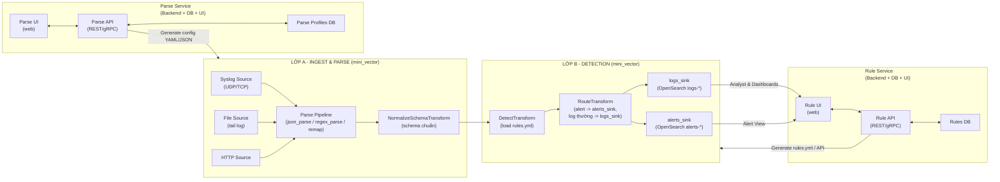

# Kiến trúc 3 lớp: mini_vector, Parse Service, Rule Service

Mục đích:

- Minh họa cách mini_vector (engine) tương tác với:
  - Parse Service (quản lý cấu hình parse).
  - Rule Service (quản lý rule detect).
- Chuẩn hóa mô hình cho việc phát triển UI + backend về sau.

---

## 1. Sơ đồ component tổng thể

